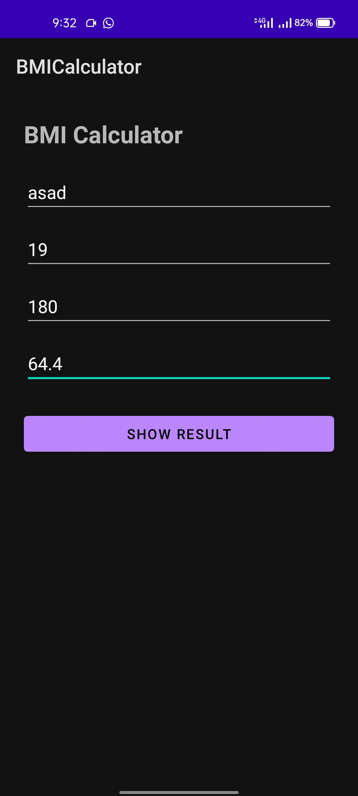
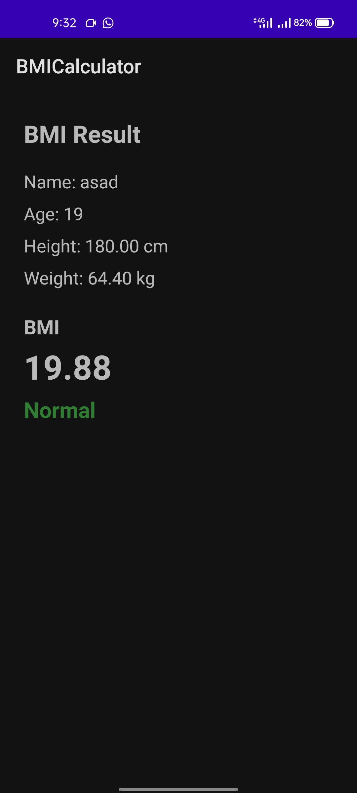
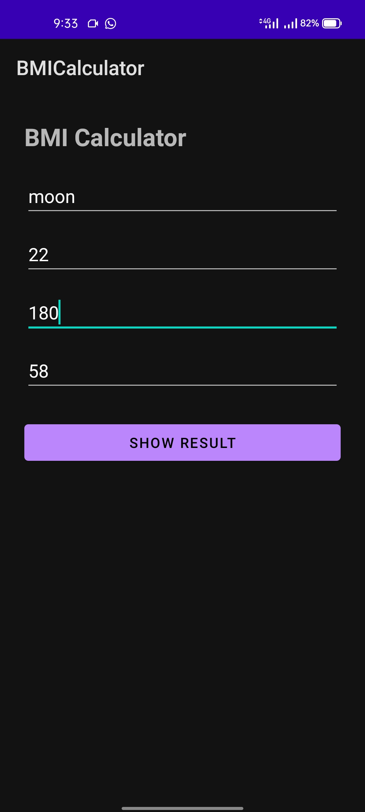
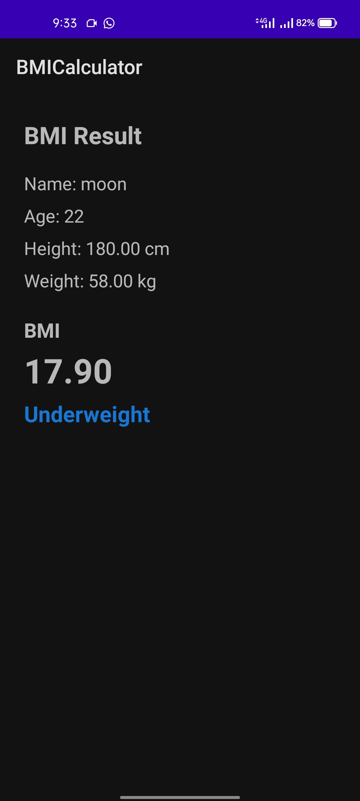

# BMI Calculator Android App

Simple Android app built with Kotlin (View system + XML layouts) to calculate Body Mass Index (BMI) from user input and show a result screen with category feedback.

## Overview

The app takes:
- Name
- Age
- Height (cm)
- Weight (kg)

After validation, it calculates BMI and opens a result screen that displays:
- Entered user details
- BMI value (formatted to 2 decimals)
- BMI category with color indicator

## Features

- Input form with validation for all required fields
- Clean two-screen flow:
  - `MainActivity`: input + validation
  - `ResultActivity`: calculation + result display
- BMI classification:
  - Underweight (`< 18.5`)
  - Normal (`18.5 - 24.9`)
  - Overweight (`>= 25.0`)
- Category color coding:
  - Underweight: Blue
  - Normal: Green
  - Overweight: Red

## BMI Formula

```text
BMI = weight_kg / (height_m * height_m)
height_m = height_cm / 100
```

## Tech Stack

- Kotlin
- Android SDK (minSdk `24`, targetSdk `36`, compileSdk `36`)
- AndroidX AppCompat + Core KTX
- Material Components
- Gradle Kotlin DSL

## Project Structure

```text
BMICalculator/
  app/src/main/java/com/example/bmicalculator/
    MainActivity.kt
    ResultActivity.kt
  app/src/main/res/layout/
    activity_main.xml
    activity_result.xml
```

## How to Run

1. Open `BMICalculator` in Android Studio.
2. Let Gradle sync complete.
3. Run the app on an emulator or physical device (Android 7.0+).
4. Enter details and tap **Show Result**.

## Screenshots

| Input Screen | Result Screen |
|---|---|
|  |  |
|  |  |
